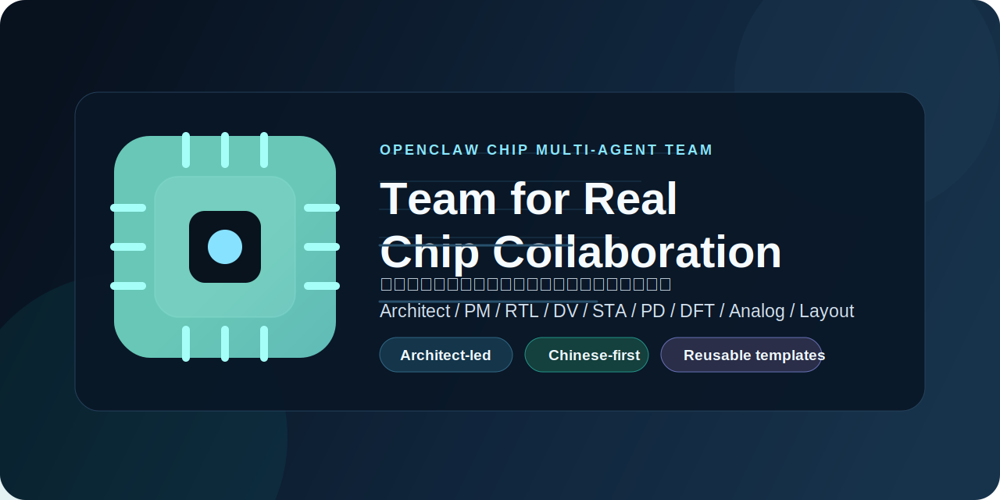
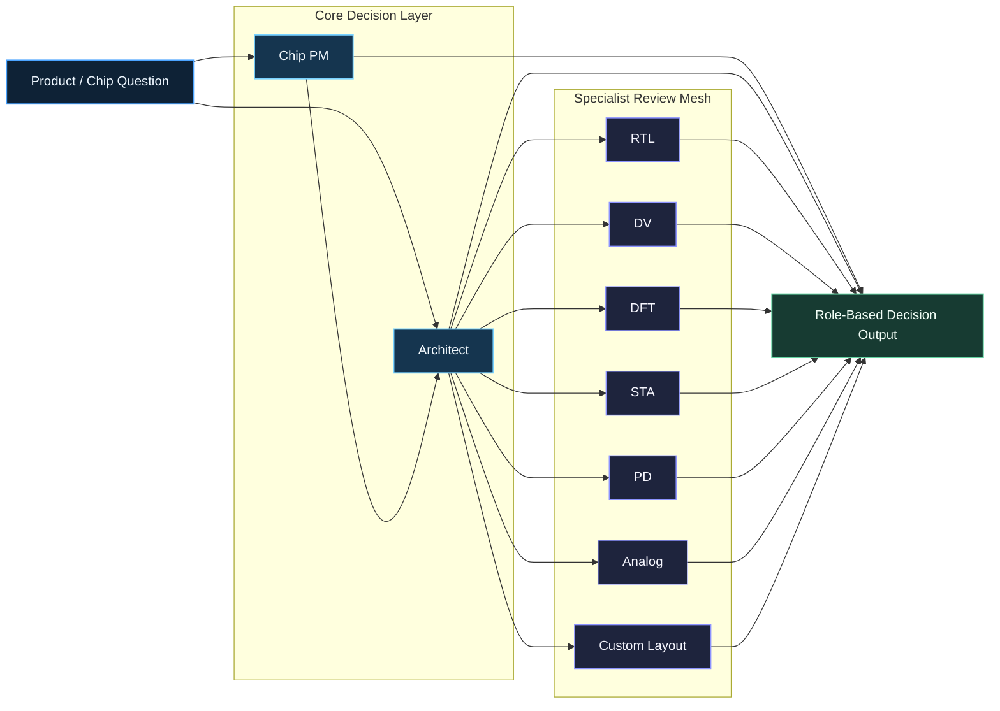

# OpenClaw Chip Agent Team

[English](README.md) | [简体中文](README.zh-CN.md)



Open-source role templates for building a serious chip and SoC multi-agent team in OpenClaw.

> A reusable OpenClaw agent squad for chip architecture, RTL, DV, STA, PD, DFT, analog, and layout collaboration.

## Start Here

- One-line install: `bash -c "$(curl -fsSL https://raw.githubusercontent.com/kichy-ge/openclaw-chip-agent-team/main/scripts/install-from-github.sh)"`
- OpenClaw chat install: paste one sentence and let the agent do the setup
- Full guide: see `INSTALL.md` / `INSTALL.zh-CN.md`

### OpenClaw One-Sentence Install

```text
Please install the GitHub repo `kichy-ge/openclaw-chip-agent-team` into my local OpenClaw environment, run its installer, and generate the config template under `~/.openclaw/`.
```

Best for teams who want:

- role-separated chip discussion instead of one blended AI voice
- requirement, architecture, RTL, DV, STA, PD, DFT, analog, and layout perspectives in one workflow
- reusable OpenClaw agent templates instead of a one-off demo
- Chinese-first technical collaboration with explicit assumptions and ownership

This repository packages a reusable collaboration structure for:

- Chip Architect
- Chip Product Manager
- RTL Frontend Designer
- Verification Engineer
- DFT Engineer
- Physical Design Engineer
- STA Signoff Engineer
- Analog Designer
- Custom Layout Engineer

The goal is not to ship a fake demo. The goal is to give you a practical team that can turn requirement debates into role-based architecture, implementation, verification, timing, and backend decisions.

## At A Glance

- 9 reusable role templates
- OpenClaw config template included
- local installer included
- safe-to-publish structure with secrets removed
- designed for real chip collaboration, not only orchestration screenshots

## Team Overview



This team is designed to turn one incoming chip question into role-separated outputs instead of one blended answer. PM frames scope, Architect judges partition and ownership, and specialists challenge feasibility from implementation, verification, timing, backend, test, analog, and layout angles.

## Why This Repo Exists

Most “multi-agent” demos stop at pretty orchestration. Real chip work is different:

- requirements and version scope must be explicit
- architecture and implementation ownership must be separated
- verification and signoff cannot be hand-waved
- backend and timing consequences must surface early

This template tries to make those role boundaries real.

## Team Roles

### Core

- **Architect**: partition, interface, gate decision. Output: architecture judgement, risk split, next owner.
- **Chip PM**: requirement baseline, version scope. Output: scope decision, must/should/later, acceptance.

### Frontend Delivery

- **RTL**: micro-architecture, protocol, datapath. Output: implementation verdict, interface assumptions.
- **DV**: proof obligation, coverage, closure. Output: verification gate, missing evidence.
- **DFT**: testability and manufacturability. Output: scan, ATPG, and MBIST implications.

### Signoff and Backend

- **STA**: timing integrity and fix ownership. Output: timing verdict, signoff risk.
- **PD**: backend feasibility and QoR closure. Output: floorplan, CTS, and route recommendations.

### Analog and Custom

- **Analog**: analog intent and characterization. Output: PVT, noise, and performance risks.
- **Custom Layout**: matching, parasitics, extraction readiness. Output: DRC, LVS, and PEX-oriented guidance.

## What Is Included

- Role contracts in `templates/agents/*/SOUL.md`
- Human-readable role playbooks in `templates/agents/*/PLAYBOOK.md`
- Reusable workspace bootstrap files in `templates/common/`
- A sanitized OpenClaw config template in `openclaw.template.json`
- An installer in `scripts/install-chip-team.mjs`
- A sample multi-agent discussion in `examples/discussions/product-branch-evaluation.md`

## Design Principles

- Chinese-first role collaboration
- direct judgement before long explanation
- explicit assumptions instead of polished ambiguity
- clear ownership between PM, Architect, RTL, DV, STA, PD, DFT, Analog, and Layout
- version and scope awareness
- no API keys, logs, private memories, or runtime transcripts in the repo

## Repository Layout

```text
templates/
  common/
  agents/
scripts/
examples/
openclaw.template.json
README.md
```

## Quick Start

1. Install OpenClaw locally.
2. Clone this repository.
3. Run:

```bash
node scripts/install-chip-team.mjs
```

4. Review the generated workspaces under `~/.openclaw/`.
5. Merge or adapt `openclaw.chip-team.template.json` into your own `~/.openclaw/openclaw.json`.
6. Replace placeholder provider keys with real credentials.
7. Restart the OpenClaw gateway.

If you want to install into another OpenClaw home:

```bash
node scripts/install-chip-team.mjs /path/to/openclaw-home
```

## One-Line Install

If you just want to install the team into your local OpenClaw home:

```bash
bash -c "$(curl -fsSL https://raw.githubusercontent.com/kichy-ge/openclaw-chip-agent-team/main/scripts/install-from-github.sh)"
```

If you want to install into a custom OpenClaw home:

```bash
bash -c "$(curl -fsSL https://raw.githubusercontent.com/kichy-ge/openclaw-chip-agent-team/main/scripts/install-from-github.sh)" -- /path/to/openclaw-home
```

## Install From Inside OpenClaw

You can also paste this directly into an OpenClaw chat:

> Please install the GitHub repo `kichy-ge/openclaw-chip-agent-team` into my local OpenClaw environment, run its installer, and generate the config template under `~/.openclaw/`.

Chinese version:

> 请把 GitHub 仓库 `kichy-ge/openclaw-chip-agent-team` 安装到我本地的 OpenClaw 环境里，执行安装脚本，并在 `~/.openclaw/` 下生成配置模板。

For all three installation paths, see `INSTALL.md` and `INSTALL.zh-CN.md`.

## What You Get After Install

The installer generates:

- `workspace-architect`
- `workspace-chip-pm`
- `workspace-rtl`
- `workspace-dv`
- `workspace-dft`
- `workspace-pd`
- `workspace-sta`
- `workspace-analog`
- `workspace-custom-layout`
- `openclaw.chip-team.template.json`

## What You Should Customize

- model provider and API keys
- `USER.md` project context for each role
- workspace paths if you use a different OpenClaw home
- which specialist agents the architect is allowed to dispatch
- whether your product direction is DDR-less, always-on, multi-camera, NPU-heavy, or something else

## Suggested Project Context Fields

The most important thing to customize is each role’s `USER.md`. Recommended fields:

- current product line
- current version or milestone
- locked constraints
- key risks
- what is explicitly out of scope
- preferred output language and style

## Recommended Use Cases

- requirement boundary review
- architecture gate discussion
- whether a request is v1.0, v2.0, or a new SKU
- RTL feasibility and interface review
- verification scope definition
- timing/signoff risk surfacing
- backend implication review before implementation starts

## Example Questions This Team Should Handle Well

- Is this request still a v1.0 change, or already a new product branch?
- Which assumptions block RTL from starting implementation?
- What exactly must DV prove before we call the scope verifiable?
- Is this a local timing fix, or an MMMC/signoff-model change?
- Can PM lock the product boundary now, or is an architect gate still required?

## Launch Copy

See `docs/launch/launch-copy.md` for bilingual GitHub launch copy and social post drafts.

## Non-Goals

This repository does not include:

- your real OpenClaw runtime logs
- your private memory files
- real provider keys
- full turnkey GitHub Actions or deployment automation
- a replacement for a real design flow

It is a team template, not a full EDA platform.

## Contributing

See `CONTRIBUTING.md` or `CONTRIBUTING.zh-CN.md`.

## License

MIT
